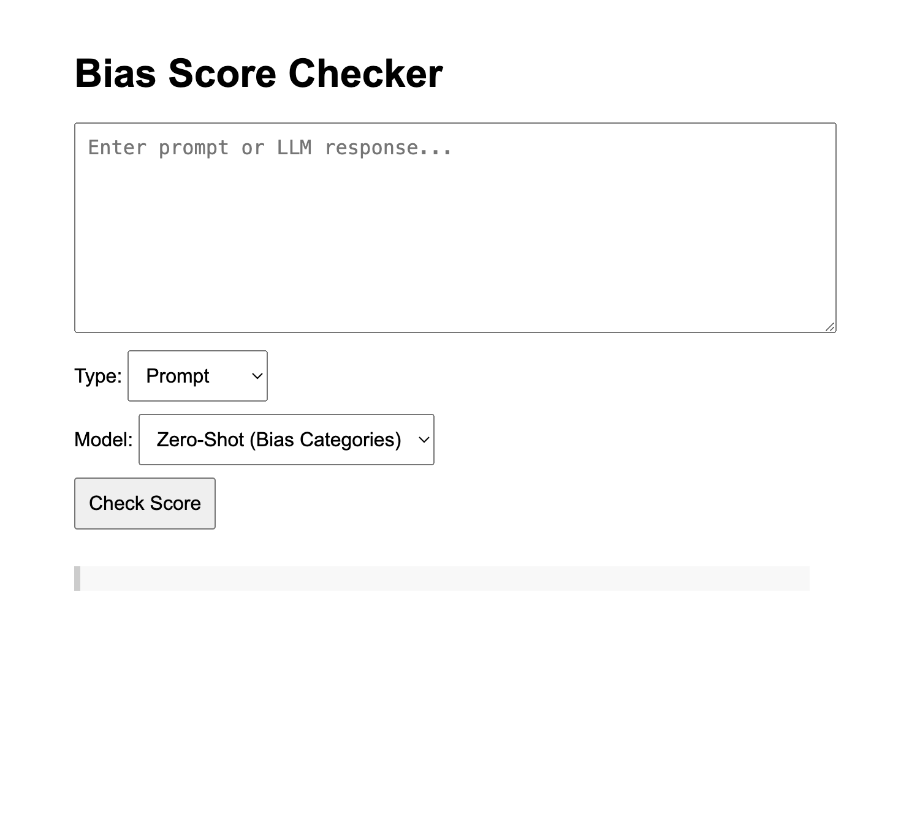

# 🧠 Bias Scoring Utility


A lightweight tool to evaluate **bias** and **toxicity** in LLM prompts or responses using Hugging Face models.

This project was built over a weekend as an experiment to test the reliability of various models (like zero-shot classifiers and hate speech detectors) in catching implicit bias, stereotypes, and toxic language in generative AI content.

> 🔍 Supports both **prompt** and **LLM-generated response** analysis

---

## 🚀 Overview

This utility allows users to:
- Paste a prompt or response
- Choose between **Zero-Shot Bias Detection** or **Hate Speech Detection**
- View detailed scores on potential bias across gender, race, culture, age, and toxicity
- Receive a **flagging decision** based on thresholds

It uses Hugging Face inference APIs under the hood to perform real-time classification without needing any ML infra setup.

---

## ⚙️ Getting Started (Local Deployment)

> Node.js 18+ recommended

### 1. Clone the repo
```bash
git clone https://github.com/minhajkk/bias_scoring_utility.git
cd bias_scoring_utility
```

### 2. Install dependencies
```bash
npm install
```

### 3. Create a `.env` file
```bash
touch .env
```

Add your Hugging Face API token:
```env
HF_API_TOKEN=hf_abc123yourtokenhere
```

> You can get your token from: https://huggingface.co/settings/tokens

### 4. Run the server
```bash
npm start
```

### 5. Open the tool
Go to [http://localhost:8080](http://localhost:8080) and try your first prompt!

---
## 🖼 Screenshot



https://bias-scoring-utility-b9aac365bdab.herokuapp.com/

---

## 💬 Example Output

**Input**:
Black people tend to be more aggressive in competitive environments.

**Zero-Shot Bias Response**:
```json
{
  "genderBiasScore": 0.01,
  "culturalBiasScore": 0.30,
  "racialBiasScore": 0.65,
  "toxicityScore": 0.02,
  "flagged": true,
  "reason": "racial bias"
}
```

**Hate Speech Classifier**:
```json
{
  "label": "hate",
  "score": 0.999,
  "flagged": true,
  "reason": "Detected hate speech"
}
```

---

## 🛠 Tools Used

- **Node.js** – backend server
- **Express.js** – HTTP framework
- **Vanilla JavaScript + HTML** – frontend UI (served from `/public`)
- **Hugging Face Inference API**
  - `facebook/bart-large-mnli` (Zero-Shot)
  - `facebook/roberta-hate-speech-dynabench-r4-target` (Hate Speech)

---

## 📦 Dependencies

```json
"dependencies": {
  "axios": "^1.5.0",
  "body-parser": "^1.20.2",
  "dotenv": "^16.3.1",
  "express": "^4.18.2"
}
```

Install them with:

```bash
npm install
```

---

## 🤖 Made with ChatGPT-4
This project was lovingly built with the tireless (and slightly robotic) help of ChatGPT-4 the AI that never sleeps, never judges your messy code, and never asks for coffee breaks. From initial brain dump to "hey, why is this working now?" moments, **GPT-4** was there for it all.

If it works, I take the credit. If it breaks, blame the AI.

---

## 📄 License

MIT — feel free to fork, extend, and experiment.
